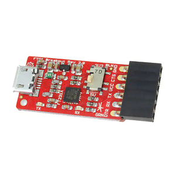
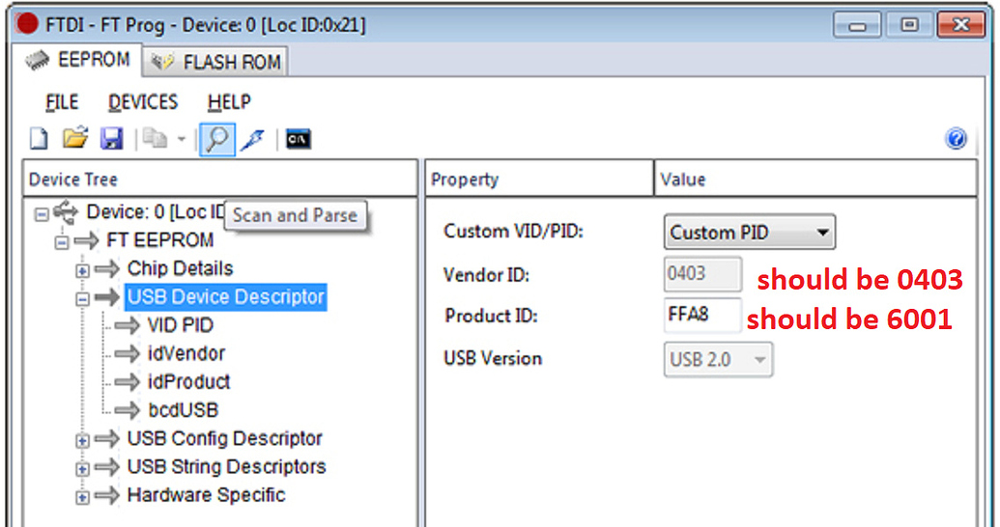
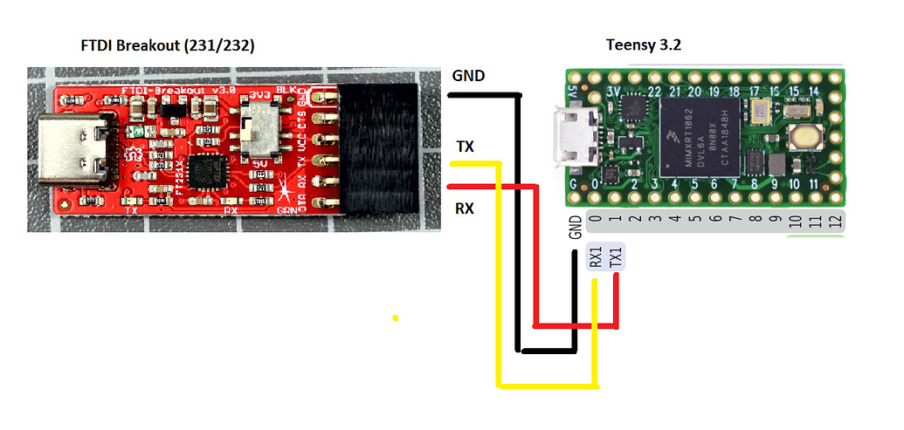

| This is a fork of the DIY Neotrellis Grid firmware<br />for use with the [Monome Teletype](https://monome.org/docs/teletype/). <br />The original DIY firmware can be found at<br />https://github.com/okyeron/neotrellis-monome |
| :----------------------------------------------------------: |
|                                                              |


## Connecting your DIY Grid to Monome Teletype

### The problem

At the time of writing (October 2020), the Monome Teletype won't talk to the Teensy-based Neotrellis DIY Grid out of the box. That's because Teletype firmware does not yet contain a driver for the USB CDC protocol, used by Teensy, whereas the stock Grid communicates to the Teletype via FTDI USB, which requires a microchip by the company with the same name. However, this driver is already worked on, so in the future the approach described here might become obsolete.

### The solution

Once you built a working DIY Grid as described in the [forum](https://llllllll.co/t/diy-monome-compatible-grid-w-adafruit-neotrellis/), you can add a second USB port to it, which talks FTDI. This second port would be used for communication, while you can still use the original USB port  for power, debugging and firmware updates. Try to get a “FTDI Breakout board” with an official 231 or 232 FTDI chip, ideally from some company such as *Sparkfun* or *Watterott*, not cheap clones. 



They would cost around $12. Make sure to choose the 3.3V variant, or a board with a switch allowing you to switch to 3.3V mode (don’t forget to do that)

Then download the FT PROG tool [available on the FTDI website](https://www.ftdichip.com/Support/Utilities.htm#FT_PROG) and connect the breakout to your computer. I think for this step you need a Windows PC, I don't think the tool is available for Mac or Linux. However, there are alternative methods for reading and programming the EEPROM of FTDI chips, [described in this tutorial](https://waterpigs.co.uk/articles/ftdi-configure-mac-linux/). 

Press “Devices”. The adapter should show. There a several pages of configuration. Open the section “USB device descriptor”, chose the option “Custom VID/PID”, and make sure that VID and PID are **ID 0403 and 6001** respectively. If not, change them, and then chose “Program device” from the context menu or toolbar (if you bought some official board, VID should already be correct, but the PIDs for adapters vary, if it is 6015, it needs to be changed to 6001). That step should save the changes permanently.





Next go to the USB String descriptors page, change the manufacturer name there to “**monome**”, and program.

Look for the “serial number” page, turn off auto-generation of the serial number (uncheck checkbox), and enter a number like **m00000000**. The first small “m” is important here. Program.

Take out the adapter, plug it in again, press again on “Devices” in FT PROG, and check that everything was saved correctly. You can also use tools like [USBDeview](https://www.nirsoft.net/utils/usb_devices_view.html) for checking USB properties.

One of my adapters, which was very cheap, would support every step above, but not remember the changes. If the same happens to you, you need to try another adapter.

Now solder the breakout box to the Teensy in the DIY Grid, in addition to the existing breakout. I would recommend to just to use jumper wires, so you can remove the breakout box if needed. If you need female or male jumper wires depends on your exact model, there are those with male and female sockets. You need three cables. Connect GND to GND, RX to TX1, TX to RX1. (On some adapters it says RXI and TXO, those are the same connections). DTR, CTS and VCC don’t need to be connected.



Later you might want to integrate this second port in the Grid.

### Changing the Teensy Grid firmware

**You can skip the following steps, if you are using the branched DIY Grid firmware for Teletype [found in this repository](neotrellis_monome_teensy/)**. This section is left for those who want to repeat the mod based on more current versions of the DIY Grid.

First open the Neotrellis Grid Teensy firmware “neotrellis_monome_teensy” in the Arduino IDE.
In the first tab, look for Serial.begin(115200); and add a Serial1.begin(57600); under it.

Search and replace Serial. with Serial1. in all open tabs, except for the debug tab.

In *MonomeSerialDevice.cpp* look for the lines

```
  Serial1.write((uint8_t)0x00); // action: response, 0x00 = system
  Serial1.write((uint8_t)0x01); // section id, 1 = led-grid, 2 = key-grid, 5 = encoder/arc	## NEED devSect variable
  Serial1.write((uint8_t)numQuads);   // one Quad is 64 buttons
```

If you have a version of the firmware, were there only those three lines, you need to duplicate them, so that you have six Serial1.write calls. (You might want to change 0x01 to 0x02 in the second block, but it probably does not play a role.)

In the same file, locate the line case 0x1A, and a the following line before any Serial1.read():
`while(!Serial1.available() ){}`, forcing the Teensy to wait for new data from the Teletype instead of rushing through it, leading to a loss of synchronization.

### Changing the Teensy board definition 

You need to do this in any case, even if you decide to use the Firmware supplied in this repository. Otherwise the communication via the FTDI port will be full of errors, leading to all kinds of mysterious light patterns. 

You need to locate the file *serial1.c* in the Teensy hardware folder for the Arduino IDE.

- Windows: *C:\Program Files (x86)\Arduino\hardware\teensy\avr\cores\teensy3\serial1.c* 
- Mac: */Applications/Arduino.app/Contents/Java/hardware/teensy/avr/cores/teensy3/serial1.c*

On Linux it should also be placed in the hardware folder next to the Arduino libraries folder (I am assuming that your IDE is already set up for the Teensy, detailed instructions can be found [elsewhere](https://www.pjrc.com/teensy/teensyduino.html))

Look for the line
` #define SERIAL1_RX_BUFFER_SIZE 64`
and replace it with
`#define SERIAL1_RX_BUFFER_SIZE 512`

(On Windows you might need admin privileges to edit this file)

### Flashing the firmware with Teletype support

Start the IDE and load the modified firmware on the Teensy. Alternatively, you can flash [the supplied .hex](neotrellis_monome_teensy/neotrellis_monome_teensy_16x8_ftdi_teletype_57600.hex) files.

Write some simple Teletype Grid script in your Teletype, such as described in “[Teletype Grid Studies](https://github.com/scanner-darkly/teletype/wiki/BASIC-VISUALIZATIONS)”. Use ALT-G to verify if the grid inside the Teletype is set up correctly.

Start up the grid and connect the breakout to the Teletype. Voila.

### Special thanks to 

@forestcaver, @okyeron, @frankchannel 

### FAQ

Q: Is it possible to make the DIY grid work with the Teletype and Norns simultaneously?

A: Yes, the easiest way is to change the Teletype's baud rate from 57600 to 115200 by a one line change in the Teletype's firmware (look at *uhi_ftdi.c* in monome's libavr32)

*Background*: The stock grids firmware communicates with the FTDI chip over a parallel port connection (manually clocking data in/out of the FTDI chip). This means the MCU doesn’t know/care about the serial baud rate – the FTDI chip can negotiate that with the host however it likes. So multiple baud rates should be possible with a monome grid.

With the DIY grid, on the other hand, the communication between the FTDI board and the teensy is done over the serial port, so an agreed upon baud rate is necessary right from the start. 